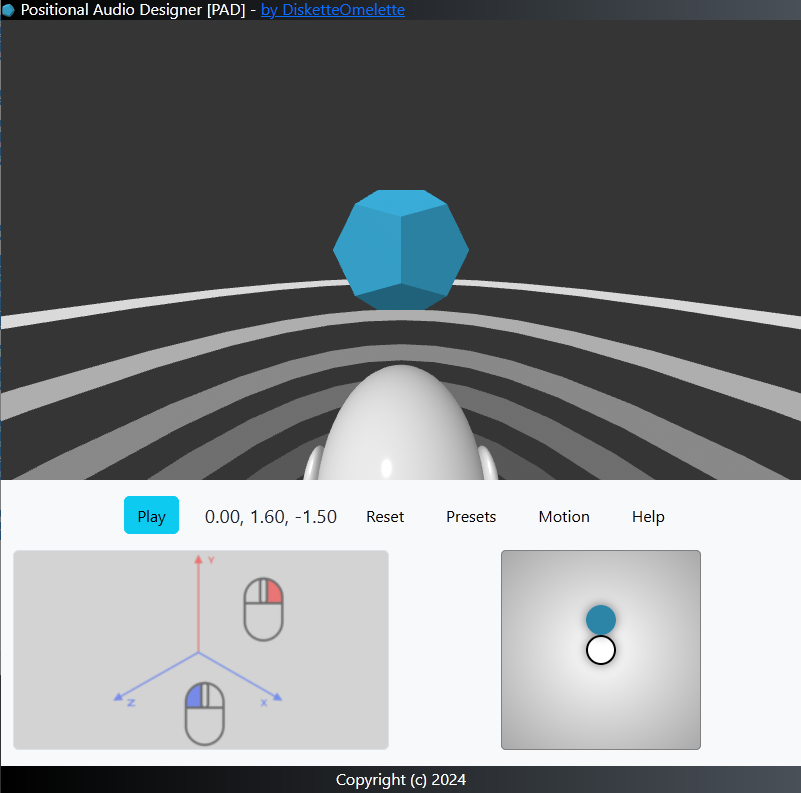

# Positional Audio Designer



## Overview

This project provides a web-based tool for real-time control of audio positioning in a 3D space using A-Frame and Bootstrap. It allows users to manipulate audio sources, creating an immersive spatial audio experience where sounds can seem to come from different directions and distances.

## Features

- **3D Audio Control**: Move the audio source in a 3D environment.
- **Preset Positions**: Quickly set the audio source to common positions.
- **Animation Options**: Animate the audio source with bounce effects.
- **Real-time Feedback**: Display current audio source coordinates dynamically.
- **Responsive Design**: Works well on different screen sizes.

## Prerequisites

To run this script, ensure you have:
- A modern web browser with WebGL support.
- An audio file named `sound.mp3` located in the same directory as the HTML file.

## Installation

1. Clone the repository:

   ```bash
   git clone https://github.com/yourusername/positional-audio-tracking.git
   cd positional-audio-tracking
   ```

2. Launch a local web server instance and navigate to  `index.html` in your preferred web browser.

## Usage

- **Control Pad**: 
  - Left-click and drag to adjust the audio source's X and Z coordinates.
  - Right-click and drag to adjust the Y coordinate.

- **Presets**: Click on the "Presets" button to quickly move the audio source to common positions (e.g., Front, Right ear, Left ear, etc.).

- **Animation**: Use the "Motion" dropdown to apply animations to the audio source.

- **Help**: Click the "Help" button for a quick guide on using the tool.

## I want to save in real-time the positional audio

You can record the positional audio you are playing in real-time. To do this, use a recording application like Audacity. Set the input to loopback, prepare a stereo audio track, and start recording. Then, launch PAD and make as many movements as you wish.

## Code Structure

- A minimized version of A-frame and Bootstrap is included in the same file, so no dependencies.
- The HTML structure defines the layout and elements for user interaction.
- CSS styles provide basic styling and responsiveness.
- JavaScript manages audio control, user interactions, and real-time updates.
 

## License

This project is licensed under the MIT License. This software uses A-frame and Bootstrap redistribuited and embed in the script. 

- [A-Frame](https://aframe.io/): A web framework for building virtual reality experiences.
- [Bootstrap](https://getbootstrap.com/): A front-end framework for building responsive web applications.
